# Jumble Jungle
---
## Live link to website

[La Citadelle] ADD LINK TO WEBSITE

## Table of Contents
<ol>
<li>User Experience
    <ul>
        <li>5trategy Plane</li>
        <li>Scope Plane</li>
        <li>Structure Plane</li>
        <li>Skeleton Plane</li>
        <li>Surface Plane</li>
    </ul>
    </li>
<li>Testing</li>
<li>Validator Testing</li>
<li>Accessibility</li>
<li>Browser Testing</li>
<li>Bugs</li>
<li>Fixed Bugs</li>
<li>Technology</li>
<li>Deployment</li>
<li>Credits</li>
</ol>

## User Experience

### 5trategy Plane
The strategy plane for Jumble Jungle was to create a game with no timer but an abudance of words. The user can only have their name on the leaderboard if they complete all the words. The Jumble Jungle game aims to create a colourful and captivating online game, while keeping users engaged.

#### Objectives
* User Engagement: Create a game that captivates and engages users, encouraging them to spend time playing and enjoying the experience. 
* Design the game to be not only entertaining but also educational, helping users improve their vocabulary and cognitive skills. 
* Challenging Gameplay: Develop puzzles that provide an appropriate level of challenge, keeping players interested and motivated to solve each word. 
* User-Friendly Interface: Design an intuitive and user-friendly interface that allows players to easily interact with the game, drag-and-drop letters, and navigate through different features. 
* Scalability: Create a game structure that allows for scalability, enabling the addition of more words or features in future updates to keep the game content fresh. 
* Hint System: Implement a hint system that assists players when needed, ensuring that the game remains accessible to a broad audience, including players of varying skill levels. 
* Feedback Mechanism: Incorporate feedback mechanisms to inform players of correct or incorrect guesses, providing a dynamic and responsive gaming experience. 
* Game Progression: Establish a sense of progression, perhaps through levels or stages, to keep players motivated to advance through the game. 
* Monetization (future endeavors): If the game could be monetized, then the cost to make the game would be low and it would be easy to add more words to keep users engaged. 
* Testing and Optimization: Regularly test the game to identify and fix bugs, optimize performance, and ensure a smooth gaming experience across different devices. 

### Scope Plane

#### Features 
Jumble Jungle was created to provide a fun, engaging and low cost and maintenace game for all to play whilst be challenging and inviting. This game is meant to be enjoyable and perhaps a game that users could enjoy or perhaps just to pass the time.

As you can see from the image below the website is compatible on all device screen sizes from the Galaxy Fold (280px screen width) and above. The layout ensures easement of gameplay with consideration as to where the buttons were located so if the user is using there phone then it minimising strain on the users hands.

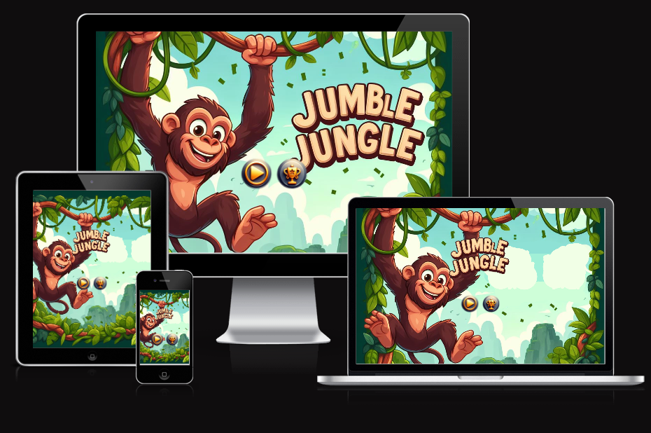

### Index.html page features

### Navigation

##### Navigation menu on devices with a screen width below 1447px width
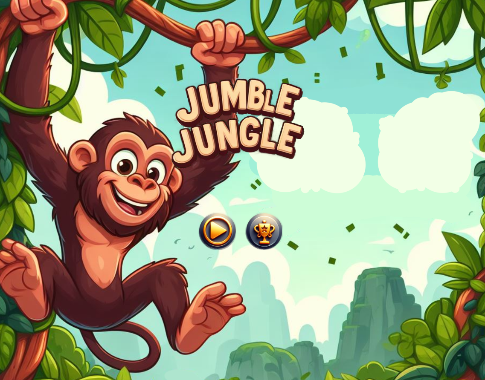

##### Navigation menu on devices with a screen width above 1447px width
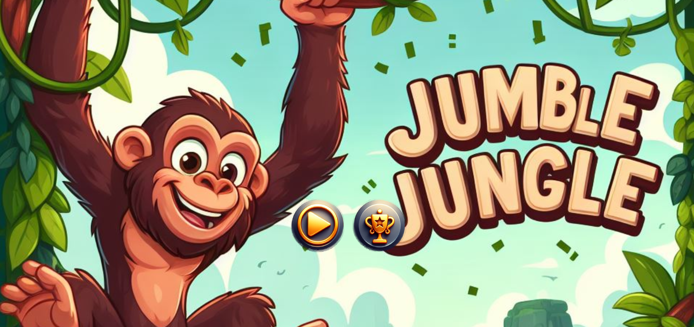

An easy to use navigation is implemented onto all pages with easily identifiable and distinguisable icons for Home, Play, Leaderboard, Restart and Help/Information.

**Home**, Which will revert back to the main page (index.html), this is a simplistic main menu with two options (Leaderboard or Game)
**Leaderboard**, Which will allow the user to jump to the leaderboard to view the league table.
**Game**, wWich will enable the user to go commence playing Jumble Jungle.

* The buttons are responsive and will fit all screens with any orientation. 
* The navigation icons/buttons are easy to understand and allow the user to understand the different sections of the website/game which allows for a greater user experience.

### Main Menu (Index)
**Navigation Buttons**
The navigation buttons are easily identifiable and work with both a mouse click and touch. They are also positioned in sections of the background image that minimise any readbility related issues.
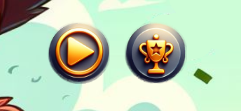
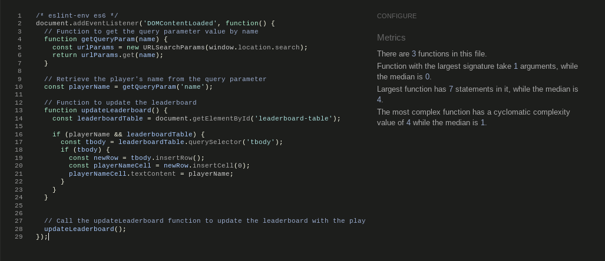

**Background Image**
The background image is responsive and although no specific H1 element is visble, the logo in the background image is responsive and moves to fit the screen depending on the screen size.

**Favicon Image**
The Favicon image is displayed with a ape with the letter J representing the intial letters of the game.
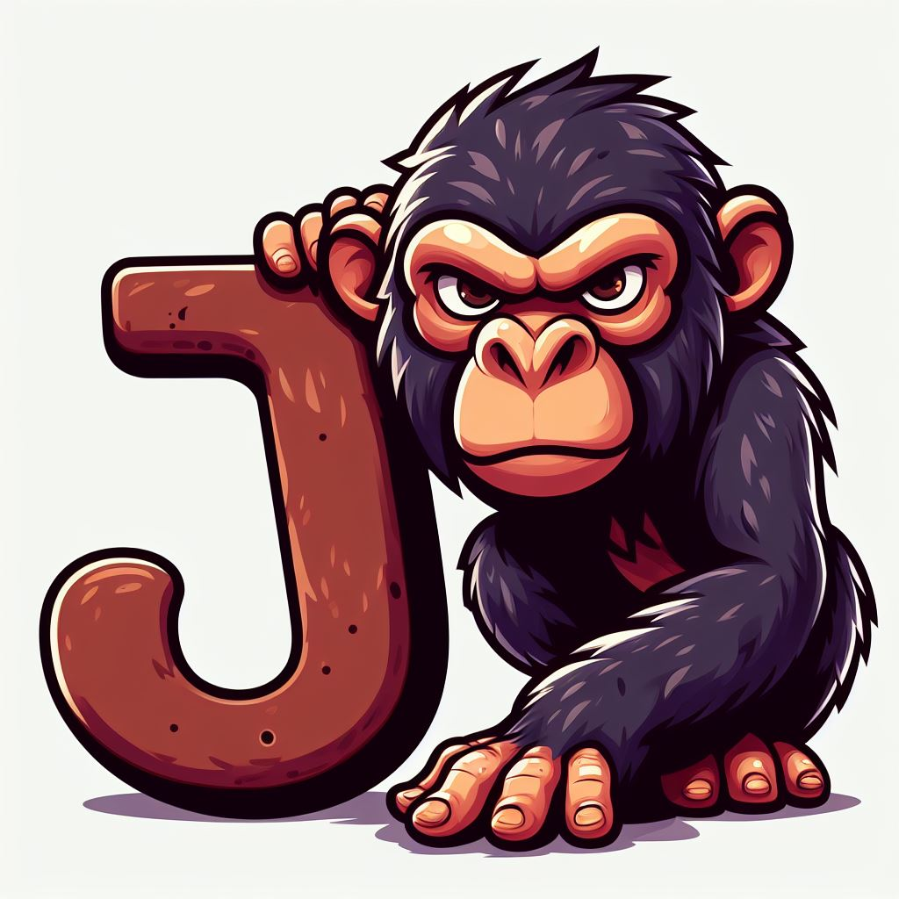

### Leaderboard
**Header**
The leaderboard page is a simple table which prepopulates when users complete the game using a local storage. The title is also distinguiable compared to its sky blue background so users who are visually impaired wont be hindered when visiting the website.
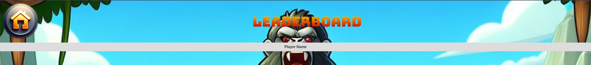
**Navigation Buttons**
The navigation buttons are easily identifiable and work with both a mouse click and touch.

**Leaderboard Table**
The leaderboard table is simpliestic and uses a local storage to add the name of the user who completes the game.
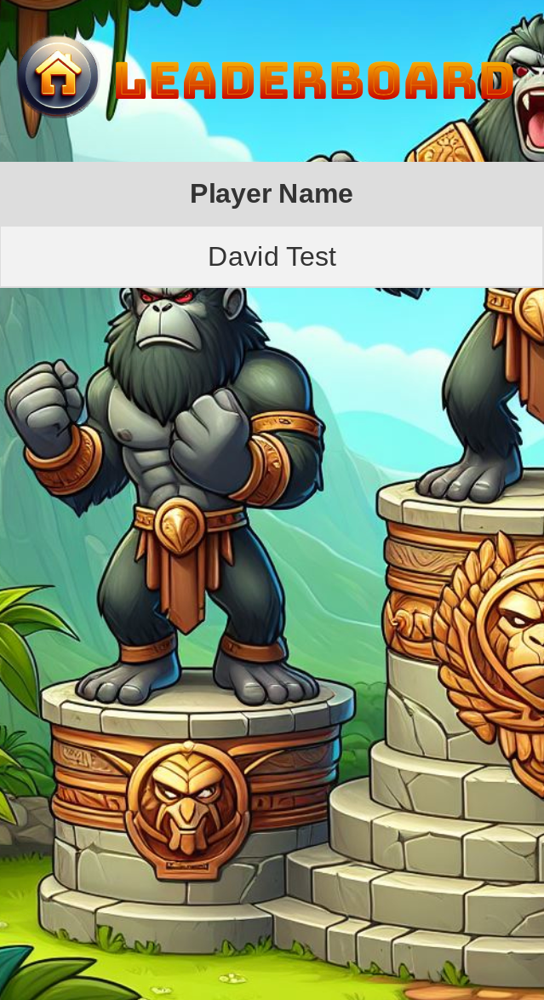
**Background Image**
The background is vibrant and displays apes on a pedistool to represent the winners of the game.
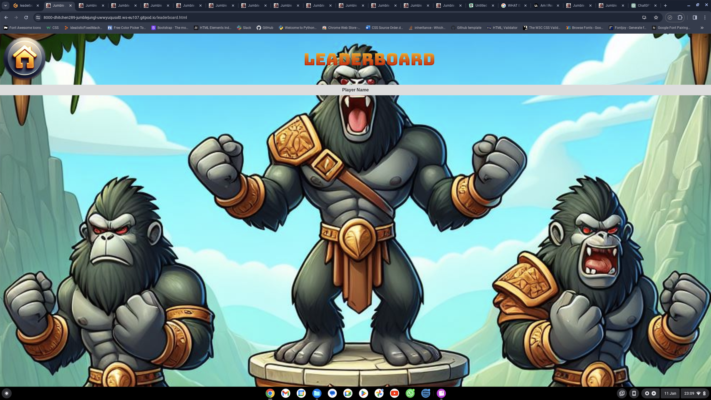

### Game
**Background Image**
The game page allows users to figure out the different 8 letter anagramss which after testing different box sizes was found to allow the most user friendly dimensions. The background although colourful has a 3d overlay affect which doesn't distract users from the game. The background is also has lighter shades to allow the containers within the game to be distinguisable from the rest of the page.
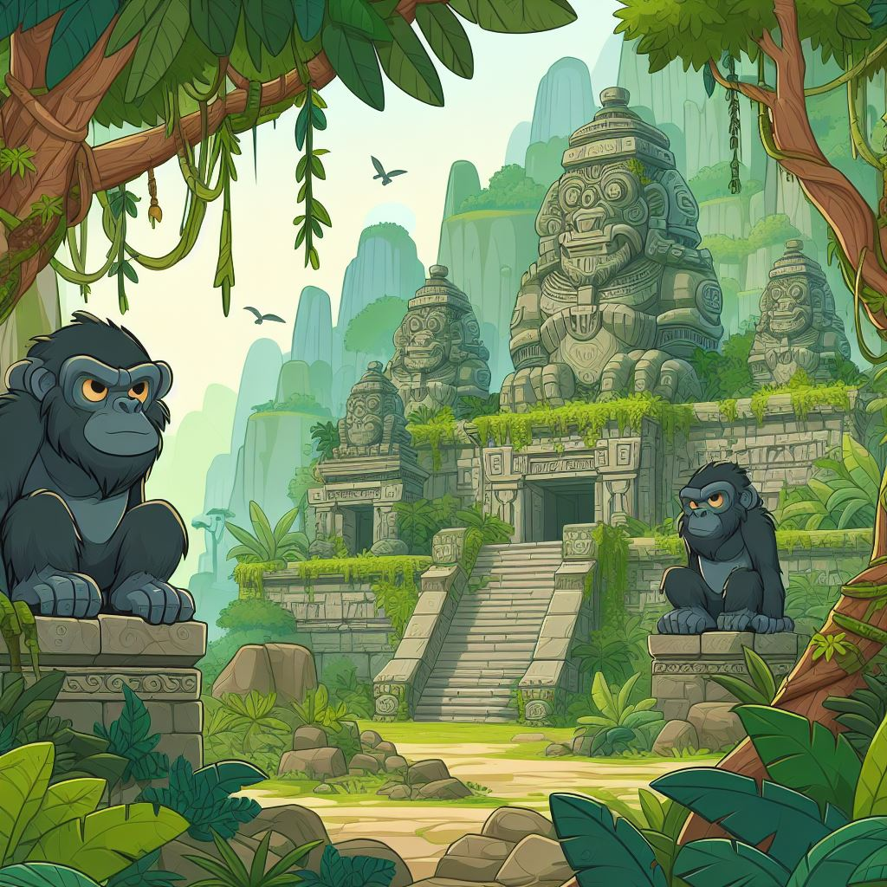
**Help Overlay**
The help overlay offers precise and condensed information that outlines the purpose of the game.
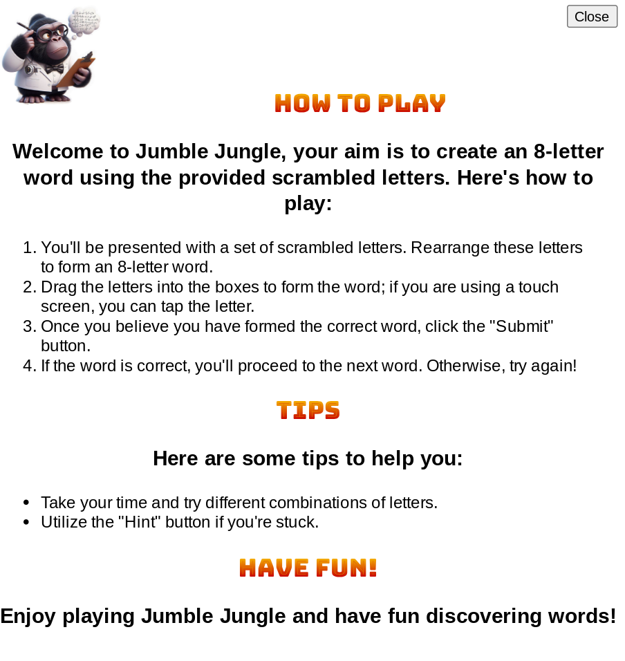

**Navigation Buttons**
Should the user wish to return to the main menu, restart the game or require help with the game then all the navigations icons/buttons are readily available.
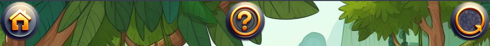

**Game Buttons**
Due to the user friendly layout and the ease of navigation the user will be able to navigate the page, and interact with the game.

**Game Container**
Below are images of the game areas. Everything the user needs will be in their veiw with no real need to scroll through pages to ascertain what the websites purpose is.
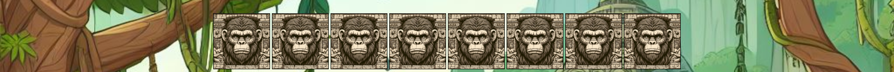
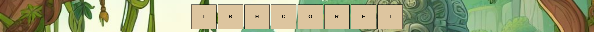
**Custom Display Notifications**
Should the user make an invalid selection, or establish the correct word, or win the game then notification boxes will be displayed.
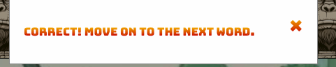
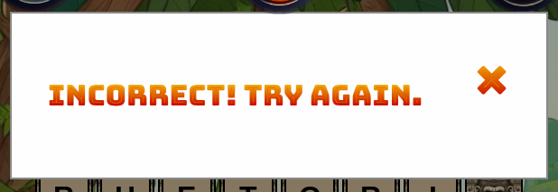
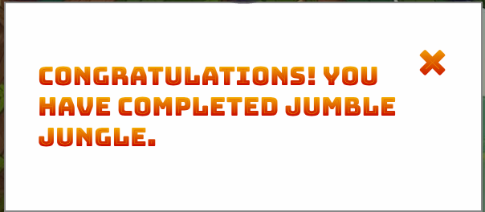
Should the user win the game then they will be given the opportunity to input thier name and be displayed on the leaderboard.
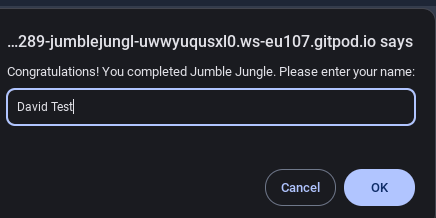

### Structure Plane
Welcome to Jumble Jungle, an engaging word puzzle game designed for both fun and mental stimulation. The game boasts a user-friendly interface with prominent buttons for easy navigation, including Play, Leaderboard, Restart, Help, and Home. The minimalist design ensures that players remain focused on the main game area, which features a letter container and a box-container. Captivating background images enhance the overall experience without distracting players from the exciting challenge of unscrambling words. Whether you're a word enthusiast or simply looking for an entertaining brain teaser, Jumble Jungle provides an immersive and enjoyable gameplay experience for all.

#### Home page(index.html):
Colourful background image with two buttons. A homepage should embody simplicity and minimalism in its design. There are two buttons on this page which are clearly visible.

#### Leaderboard page(leaderboard.html):
A colourful leaderboard page which offers details about past winners, featuring a minimalist design that prioritizes the game as the main focus. There is one button the page which will divert the user back to the homepage.

#### Game page(game.html):
The gaming page features the central gaming section with a letter container and a box-container. Alongside, there are three buttons for easy navigation – one leading to the homepage, another providing game information, and the third allowing the user to restart the game. Complementing the layout, there's a background image and three more buttons that interact with the game directly. These include a hint button for user assistance, a delete button enabling move reversal, and a submit button for making inputs and playing the game.

#### Additional Functionalities:
**Responsive Design:** Ensuring the website works seamlessly across various devices (desktop, tablet, mobile).
**Navigation Buttons:** Quick access to important pages.

### Skeleton Plane

#### Home Page:
Background Image: Colourful and welcoming background image which contains a responsive title within the image itself.
Play Button: Initiates the game, leading the player to the main game area.

Leaderboard Button: Allows players to view information on previous winners, emphasizing a minimalist display.

#### Game Page:
Background Image: Captivating visuals that enhance the gaming experience without causing distraction.

Box-Container: Contains boxes where players drag and drop letters to form the correct word.

Boxes: Eight boxes within the box-container where the letters are placed.
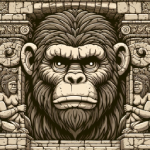

Letter Container: Displays scrambled letters for players to rearrange into an 8-letter word.

**Buttons for Interaction:**
Help Button: Provides guidance on how to play the game, ensuring accessibility for all players.

Hint Button: Offers players a hint when needed, enhancing the gameplay experience.
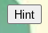
Delete Button: Allows players to undo a move, adding a strategic element to the game.
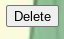
Submit Button: Enables players to input their word and progress in the game.
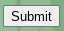

**Buttons for Navigation:**
Home buton will direct the user back to the home page.

Restart Button: Enables players to restart the current game, maintaining a seamless gaming experience This button effectively refreshs the game.html page.

#### Leaderboard Page:

Minimalistic View: Emphasizes simplicity in presenting information about previous winners, maintaining focus on the game.
Home Button: Offers quick navigation back to the homepage for user convenience.

**Overall Design Philosophy:**
User-Friendly Interface: Ensures ease of navigation with prominently placed buttons.
Minimalist Design: Focuses on the essential game elements, providing a clean and enjoyable user experience.
Immersive Gameplay: Balances captivating background images with a design that keeps players engaged in the word puzzle challenge.
By incorporating these elements, Jumble Jungle aims to provide players with a delightful and intellectually stimulating game.

**Responsive Design:**
**User friendly** Ensuring the layout adjusts seamlessly for various screen sizes (desktop, tablet, mobile).
**Consistent Design Elements:** Maintaining a cohesive visual style, typography, and color scheme across all pages.
**Clear Hierarchy and Visual Hints:** Using visual cues like buttons, icons, and colors to guide users through the site.

### Surface Plane

**Objective:**
Guess and arrange scrambled letters to form 8-letter words.

**Navigation:**
Homepage:
Play Button: Start the game.
Leaderboard Button: View previous winners.
Restart Button: Begin a new game.
Help Button: Access game instructions.
Home Button: Return to the homepage.

**Main Game Area:**
Letter Container: Displays scrambled letters.
Box-Container: Allows drag-and-drop for arranging letters.
Background Images: Engaging visuals without distraction.

**Interaction:**
Hint Button: Provides clues to the word.
Delete Button: Allows undoing a move.
Submit Button: Input the formed word and progress.

**Scoring:**
Completion of each word advances the player.
Leaderboard showcases top players.

**Help Section:**
Clear instructions on gameplay.
Tips for successful word formation.

**Design Philosophy:**
User-Friendly: Easy navigation and intuitive controls.
Minimalistic: Focus on essential elements for a clean interface.
Immersive: Balancing captivating visuals with gameplay.

**Conclusion:**
Jumble Jungle offers an engaging word puzzle experience with a user-friendly interface, minimalist design, and captivating visuals. Players can navigate easily, access help when needed, and enjoy the challenge of unscrambling words to progress and compete for a spot on the leaderboard.

## Testing
Below is a table showing various actions performed on the website including the expected/desired outcome with the result on the final column.

| Action                                                                                    |Expected Result                                                                                    | Result                                                 |
| :---------------------------------------------------------------------------------------- | :------------------------------------------------------------------------------------------------ | :----------------------------------------------------- |
| Load index.html page                                                                      | The Homepage should load                                                                          | Homepage loaded                                        |
| Load leaderboard-html page                                                                | The leaderboard page should load                                                                  | leaderboard page loaded                                |
| Load game.html page                                                                       | The game page should load                                                                         | Game.html page loaded                                  |
| Click on the h1 logo on the leaderboard page                                              | The user should divert user to the homepage                                                       | Home page loaded                                       |
| Click home button on the leaderboard page (both desktop and mobile device)                | The user should be directed to the homepage (index.html)                                          | Homepage loaded                                        |
| Click play button on homepage (both desktop and mobile device)                            | The user should be directed to the game.html page                                                 | Game page loaded                                       |
| Click leaderboard button on the homepage(both desktop and mobile device)                  | The user should be directed to the leaderboard.html page                                          | Leaderboard page loaded                                |

| Click home button on the game page (both desktop and mobile device)                       | The user should be directed to the homepage (index.html)                                          | Homepage loaded                                        |
| Click help button on the game page (both desktop and mobile device)                       | The help overlay should be displayed                                                              | Help overlay displayed                                 |
| Click restart button on the game page (both desktop and mobile device)                    | The game page should refresh                                                                      | Game page loaded                                       |
| Click hint button on the game page (both desktop and mobile device) (not visible)         | The hint associated with the word should be displayed                                             | Hint displayed                                         |
| Click hint button on the game page (both desktop and mobile device) (visible)             | The hint associated with the word should no longer be displayed                                   | Hint not displayed                                     |
| Click submit button on the game page (both desktop and mobile device) Correct             | Chosen word inputted (Correct notification will be displayed and user will move on to next word)  | Correct notification displayed and next word loaded    |
| Click submit button on the game page (both desktop and mobile device) Incorrect           | Chosen word inputted (Incorrect notification will be displayed and user will be able to try again)| Correct notification displayed                         |
| Click submit button on the game page (both desktop and mobile device) Final word          | Chosen word inputted (Congratulations notification will display and name input should be shown)   | Correct notification displayed and name input box shown|
| User inputs name after completing game(both desktop and mobile device)                    | User should be able to type name and be diverted to leaderboard where this will be displayed      | Name input accepted and diverted to leaderboard        |
| Click delete button on the game page (both desktop and mobile device)                     | The inputs.letters should be removed (1 letter per touch/click)                                   | Letter(s) deleted                                      |
| Touch letters using touch screen on the game page (both laptop and mobile device)         | The letter should go to the next available box within the box container                           | Letters move as they should                            |
| Click, drag and drop letters on the game page (both desktop and mobile device)            | The user should be able to place the letters in any box                                           | Letters move as they should                            |

## Validator Testing

### HTML
No errors were report when passing through the official W3C HTML validator.

#### index.html
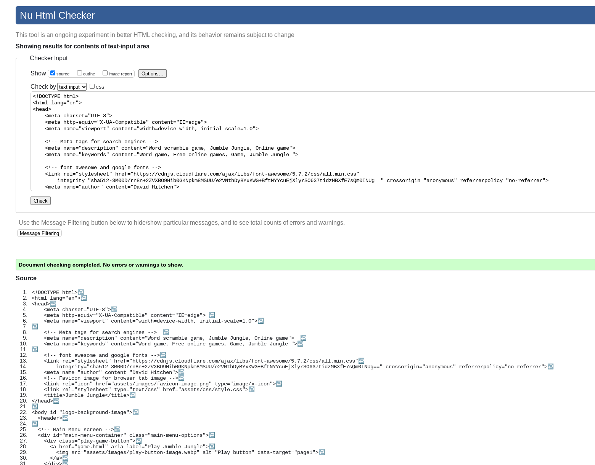

#### game.html
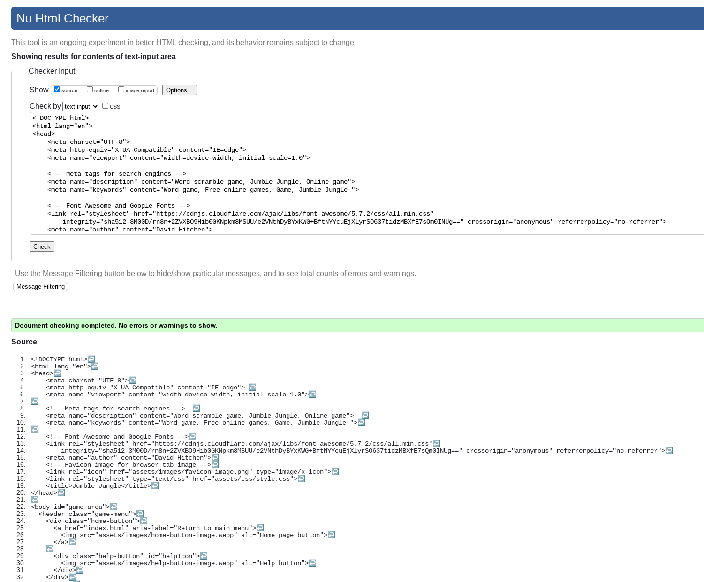

#### leaderboard.html
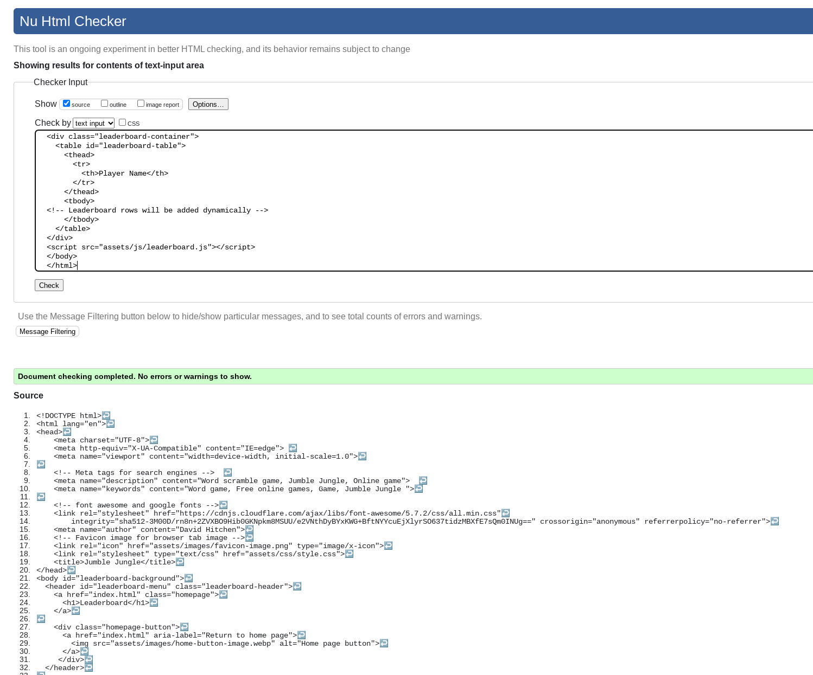

### CSS
* No errors were report when passing through the official W3C CSS validator.
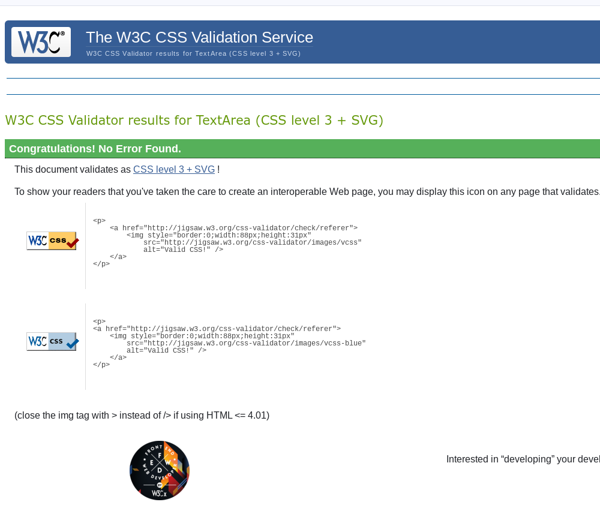

### Javascript
* No errors were report when passing through the official JSHINT JS validator.
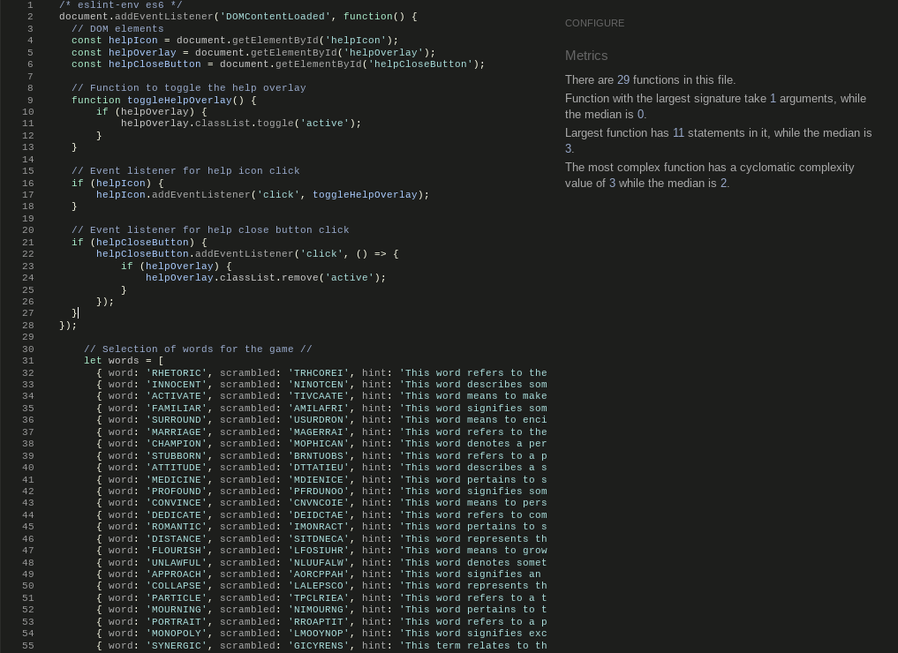

## Accessibility
* I confirmed that the colors and fonts chosen are easy to read and accessible by performing analysis using Lighthouse in Devtools. I conduct a scan on each page and the results of both the mobile and desktop scans are below:

#### Index.html desktop results
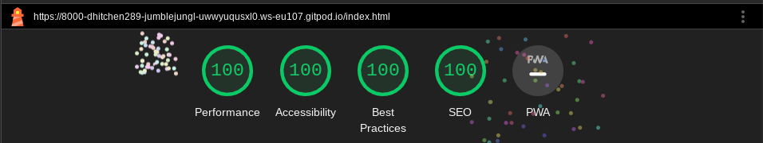

#### Index.html mobile results
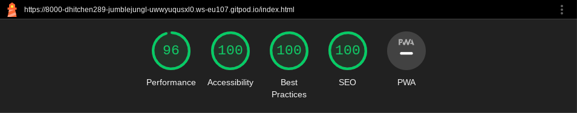

#### Game.html desktop results
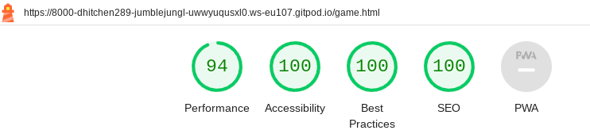

#### Game.html mobile results

#### Leaderboard.html desktop results
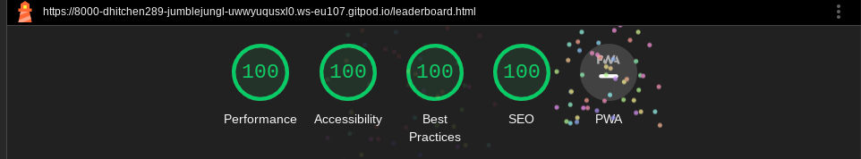

#### Leaderboard.html mobile results
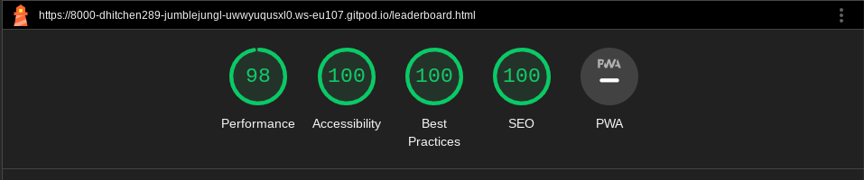

## Browser Testing
* I conducted browser testing on various devices and web browsers and they are listed below:
        
### Browsers
**Google Chrome**
**Safari**
**Brave**
**Microsoft Edge**
**Mozilla Firefox**
**Internet Explorer**

### Devices
**Android**
**Iphone**
**Dell laptop**
**Asus Chromebook**
**Apple Imac**

## Bugs
* While reviewing my site i received an error shown below which indicated that I was not able to use an attribute. This was subsubsequently removed

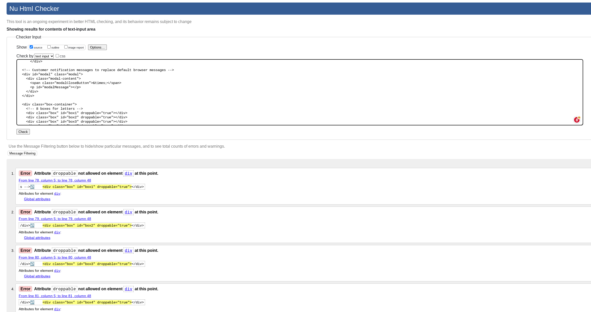

## Unfixed Bugs
* No unfixed bugs.

## Technologies

### Tools

[Googlefonts](https://fonts.google.com/) 
For Font styles of header.

[DevTools](https://developer.chrome.com/docs/devtools/)
For improvement and use of device eumulators.

[ChatGPT 3.5](https://chat.openai.com/)
For swiftly reviewing code to find discrepancies including spell checking.

[HTML Validation Service](https://validator.w3.org/)
For the validation of the index.html, bookings.html, and the menu.html.

[CSS Validation Service](https://jigsaw.w3.org/css-validator/)
For the validation of the style.css

[Microsoft Bing ai image creator](https://www.bing.com/chat)
For creating images relevant to my game design

[Photopea](https://www.photopea.com/)
For the editing of images.

### Languages

**HTML**
**CSS**
**JS**

## Deployment
* The site was deployed to GitHub pages. The steps to deploy are as follows:
    *In the GitHub repository, navigate to the settings tab.
    *From the source section drop-down menu, select the Master Branch.
    *Once the master branch has been selected, the page provided the link to the completed website.

The link can be found here - [Jumble Jungle]()

## Credits

**Media**
* All images were downloaded from [Microsoft Bing ai image creator](https://www.bing.com/chat)
* All images were edited using [Photopea](https://www.photopea.com/)

